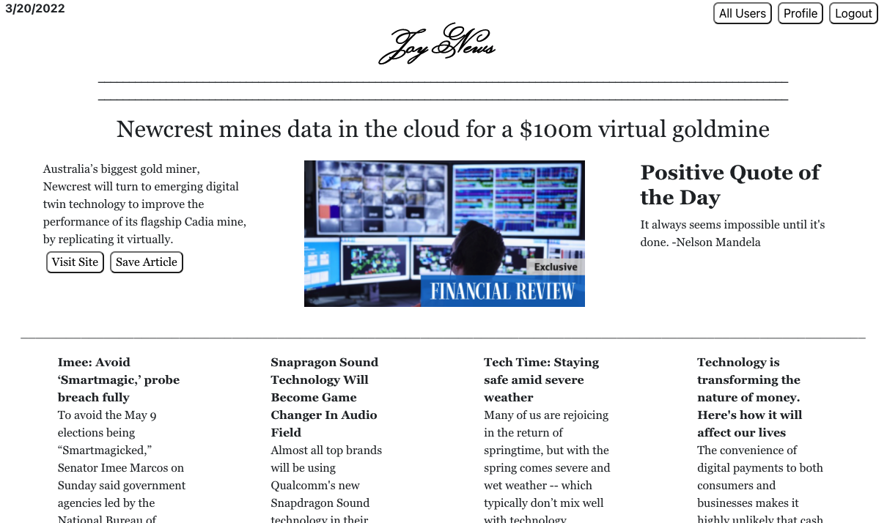

# Movie Me!
This is a work in progress, I am rebuilding my original group project at https://josh2100.github.io/movie-me/ into a MERN stack application. 

MERN Stack Application for movie recommendations

Deployment: deployment here

## Table of Contents

- [Installation](#installation)
- [Usage](#usage)
- [License](#license)
- [Contributions](#contributions)
- [Technologies](#technologies)
- [Credits](#credits)
- [Questions](#questions)

## Installation

Use "npm install" to install required modules for this application. 

## Usage

Select a genre to get a movie recommendation. Sign up or log in to add a movie to your watchlist. 

## License

This project is licensed under the MIT license.

## Contributions

Fork the project and create a pull request. Let me know how you think you can contribute!

## Technology Used

  
  
    
  
   
  
  
  
 

## Credits

Created by Joshua Schermann, a spinoff of my original group project with Henry Olson.

## Questions

Post an issue if you see a bug or suggested improvement. 